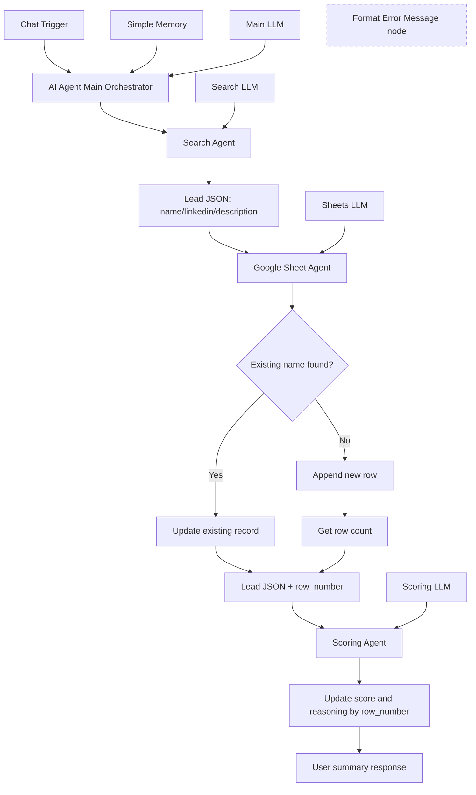

# n8n-workflows

This repository contains n8n learning workflows and assignments from the Maven AI Builders Bootcamp.

## What this repository is about

`workflow-qualification-agent.json` defines a multi-agent lead qualification pipeline in n8n.  
It accepts a chat prompt, gathers lead details, stores or updates lead data in Google Sheets, scores the lead, and writes back the score plus reasoning.

## Problem being solved

Manually researching leads, recording details, and assigning qualification scores is repetitive and inconsistent.  
This workflow solves that by automating the full enrichment + scoring flow with clear orchestration and structured outputs, so lead tracking is faster and more reliable.

## High-level design flow

## Brief design overview

- **Main orchestrator + memory:** The main AI agent handles chat requests with a 10-message memory window and enforces the sequence Search -> Sheet upsert -> Scoring.
- **Specialized agents:** Search, Google Sheet, and Scoring each run with a dedicated LLM node to keep responsibilities isolated.
- **Sheet upsert logic:** The Google Sheet agent first checks for an existing name, updates if found, or appends if new.
- **Deterministic row targeting:** For new entries, row count is fetched right after append to derive `row_number`, which is passed forward.
- **Scoring write-back:** The Scoring agent computes Hot/Warm/Cold with score and reasoning, then updates the exact sheet row using `row_number`.
- **Error UX preparedness:** A `Format Error Message` node exists to standardize user-facing error text.

## Project files

- `workflow-qualification-agent.json`: Main n8n workflow export file.
- `workflow-screenshots/qualificationAgent-workflow.png`: Visual snapshot of the workflow canvas.
- `.gitignore`: Ignore rules for local/system and environment artifacts.

## Node mapping

| Node name | Purpose |
| --- | --- |
| `When chat message received` | Entry point that receives user chat input and starts orchestration. |
| `AI Agent [Main]` | Central orchestrator that enforces Search -> Sheet upsert -> Scoring sequence. |
| `OpenAI Chat Model` | Language model used by the main orchestrator. |
| `Simple Memory` | Maintains short conversation context (`contextWindowLength: 10`). |
| `Search Agent` | Researches lead details and returns structured JSON. |
| `OpenAI Chat Model1` | Language model used by the Search Agent. |
| `Google Sheet Agent` | Upserts lead data and ensures `row_number` is available. |
| `OpenAI Chat Model2` | Language model used by the Google Sheet Agent. |
| `Search for existing record` | Checks if a lead already exists by name in the sheet. |
| `Update existing record` | Updates existing row fields (`name`, `linkedin`, `description`). |
| `Append row in sheet in Google Sheets` | Appends a new lead record when no match exists. |
| `Get row count after append` | Retrieves total rows to derive the new row number. |
| `Scoring Agent` | Scores lead (Hot/Warm/Cold), generates reasoning, and triggers write-back. |
| `OpenAI Chat Model3` | Language model used by the Scoring Agent. |
| `Update latest row by row number` | Writes score and reasoning to the exact row identified by `row_number`. |
| `Format Error Message` | Formats a user-friendly error output when processing fails. |

## How to import and run in n8n

1. Open your n8n instance.
2. Create a new workflow and choose **Import from file**.
3. Select `workflow-qualification-agent.json` from this repository.
4. Open each node that requires credentials and connect:
   - OpenAI credentials for the Chat Model nodes.
   - Google Sheets OAuth2 credentials for Google Sheets tool nodes.
5. Verify that the Google Sheet document and sheet references match your target sheet.
6. Save the workflow and click **Execute workflow** (for testing) or **Activate** (for live use).
7. Start from the chat trigger endpoint/UI and send a lead query message.
8. Confirm results in Google Sheets:
   - Lead data is created/updated (`name`, `linkedin`, `description`)
   - Score and reasoning are written to the correct row.
