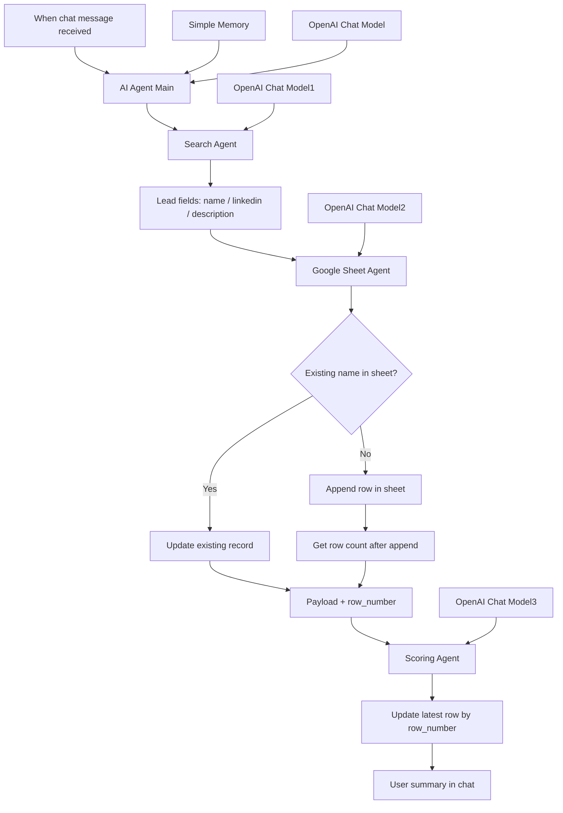

# n8n-workflows

This repository contains n8n learning workflows and assignments from the Maven AI Builders Bootcamp.

## What this repository is about

`workflowqualificationagent.json` exports an n8n workflow named **Workflow - Qualification Agent**. It is a multi-agent lead qualification pipeline: a public chat UI (**Samvad**) receives messages, researches a lead, upserts row data in Google Sheets, scores the lead (0–100 with Hot / Warm / Cold), and writes **score** and **reasoning** back to the matching sheet row.

## Problem being solved

Researching leads, capturing structured fields in a spreadsheet, and scoring them consistently is slow and error-prone when done manually. This workflow automates **enrichment → persistence → scoring** with a fixed handoff (especially **`row_number`**) so updates land on the correct row and the team gets a repeatable qualification pipeline.

## High-level design flow

## Brief design overview

- **Entry:** LangChain **Chat Trigger** (public chat, agent display name **Samvad**) forwards user turns to **AI Agent [Main]**.
- **Orchestration:** The main agent’s system prompt enforces **Search Agent → Google Sheet Agent → Scoring Agent**, then a short user-facing summary.
- **Models:** Each agent uses its own **OpenAI Chat Model** node; the export is configured for **`gpt-4o-mini`** (re-bind or change model IDs after import if your n8n instance differs).
- **Memory:** **Simple Memory** (`contextWindowLength: 10`) is attached only to the main agent for conversational continuity.
- **Search Agent:** Up to **3** tool iterations; returns structured **name**, **linkedin**, **description** for downstream steps.
- **Google Sheet Agent:** Searches by **name**, then either **updates** an existing row or **appends** a new one; after append it uses **Get row count after append** so **`row_number`** matches the new data row (row 1 is treated as header in the agent instructions).
- **Scoring Agent:** Scores 0–100, maps to Hot (80+), Warm (60–79), Cold (under 60), formats **classification (score)** for the sheet, and calls **Update latest row by row number** using the **`row_number`** from the sheet agent output—no separate row lookup in the scoring step.
- **Persistence:** Sheet tools target the spreadsheet referenced in the JSON (**Maven Week 3** / **Sheet1** in the export); replace with your own document and sheet after import.

## Project files

- `workflowqualificationagent.json`: n8n workflow export (**Workflow - Qualification Agent**).
- `workflow-screenshots/`: Canvas screenshots (e.g. `Screenshot 2026-03-26 at 7.00.55 PM.png`).
- `.gitignore`: Local, editor, and environment noise (including `.env` patterns).

## Node mapping

| Node name | Purpose |
| --- | --- |
| `When chat message received` | Chat trigger; starts the main agent on each user message. |
| `AI Agent [Main]` | Lead enrichment orchestrator; strict tool order Search → Sheet → Scoring. |
| `OpenAI Chat Model` | LLM for the main agent (`gpt-4o-mini` in export). |
| `Simple Memory` | Conversation buffer (10 messages) for the main agent. |
| `Search Agent` | Sub-agent tool; researches lead → structured name / linkedin / description. |
| `OpenAI Chat Model1` | LLM for Search Agent. |
| `Google Sheet Agent` | Sub-agent tool; upsert + returns payload including **`row_number`**. |
| `OpenAI Chat Model2` | LLM for Google Sheet Agent. |
| `Search for existing record` | Sheet tool: lookup by **name** column. |
| `Update existing record` | Sheet tool: update **name**, **linkedin**, **description** by **`row_number`**. |
| `Append row in sheet in Google Sheets` | Sheet tool: append new lead row (score/reasoning columns omitted from append mapping). |
| `Get row count after append` | Sheet tool: total rows (used to infer new row’s **`row_number`**). |
| `Scoring Agent` | Sub-agent tool; scores lead and drives score/reasoning write-back. |
| `OpenAI Chat Model3` | LLM for Scoring Agent. |
| `Update latest row by row number` | Sheet tool: writes **score** and **reasoning** matched on **`row_number`**. |

## How to import and run in n8n

1. Open your n8n instance.
2. **Import from file** and choose `workflowqualificationagent.json`.
3. Re-apply **credentials** on every **OpenAI** and **Google Sheets** node (imports only carry credential names/IDs from the source instance).
4. Point **documentId** / **sheetName** on all Sheet nodes at **your** spreadsheet and tab; align column headers with **name**, **linkedin**, **description**, **score**, **reasoning**, and **`row_number`** if your sheet uses that column for updates.
5. Confirm each **OpenAI Chat Model** uses a model available on your account (export uses **`gpt-4o-mini`**).
6. Save, **Execute** for a test run, or **Activate** for production; use the **chat** entry point and ask about a lead.
7. In Google Sheets, verify: lead fields updated or appended, then **score** / **reasoning** on the same **`row_number`**.
