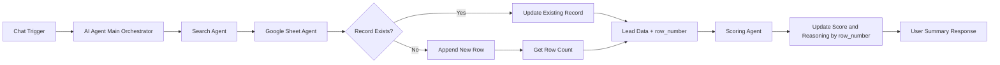

# n8n-workflows

This repository contains n8n learning workflows and assignments from the Maven AI Builders Bootcamp.

## What this workflow is about

`workflow - qualificationAgent.json` defines a multi-agent lead qualification pipeline in n8n.  
It accepts a chat prompt, gathers lead details, stores or updates lead data in Google Sheets, scores the lead, and writes back the score plus reasoning.

## Problem being solved

Manually researching leads, recording details, and assigning qualification scores is repetitive and inconsistent.  
This workflow solves that by automating the full enrichment + scoring flow with clear orchestration and structured outputs, so lead tracking is faster and more reliable.

## High-level design flow

## Brief design overview

- **Main orchestrator:** Enforces strict sequence: Search -> Sheet write/update -> Scoring.
- **Search agent:** Produces structured lead JSON (`name`, `linkedin`, `description`).
- **Google Sheet agent:** Upserts lead data and guarantees a correct `row_number` for downstream updates.
- **Scoring agent:** Calculates lead score/classification (Hot/Warm/Cold) and stores score + reasoning in the same row.
- **Reliability focus:** Row-number handoff between agents prevents updates from landing on the wrong record.

## How to import and run in n8n

1. Open your n8n instance.
2. Create a new workflow and choose **Import from file**.
3. Select `workflow - qualificationAgent.json` from this repository.
4. Open each node that requires credentials and connect:
   - OpenAI credentials for the Chat Model nodes.
   - Google Sheets OAuth2 credentials for Google Sheets tool nodes.
5. Verify that the Google Sheet document and sheet references match your target sheet.
6. Save the workflow and click **Execute workflow** (for testing) or **Activate** (for live use).
7. Start from the chat trigger endpoint/UI and send a lead query message.
8. Confirm results in Google Sheets:
   - Lead data is created/updated (`name`, `linkedin`, `description`)
   - Score and reasoning are written to the correct row.
